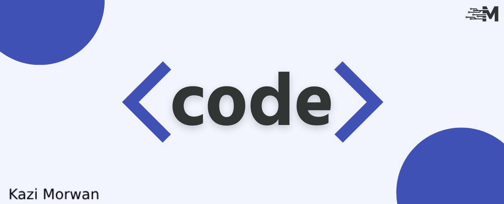

  

 

<h1 align="center">Hi 👋, I'm Kazi Morwan</h1>
<h3 align="center">Frontend Developer | Speed Learner</h3>

Skills: HTML / CSS / JS / React.js

 

- 🔭 I’m currently learning on [Hablu Programmer](https://www.hablu-programmer.com/)

- 🌱 I’m currently learning Frontend-web-development.

- 👨‍💻 All of my projects are available at [GitHub](https://github.com/kazimorwan498)

- 💬 Ask me about **HTML, CSS, JS**

- 📫 How to reach me: **<kazimdmorwan498@gmail.com>**

 

## Connect with me

    
    
    
    
    

 

## Use To Code

  
  
  
  
  
  
  
  
  
  
  

 

## Best Repositories

  

  

  

  

 

 

## Github Stats

  

    
    

  

 
 

## Connect with me

    
    
    
    

